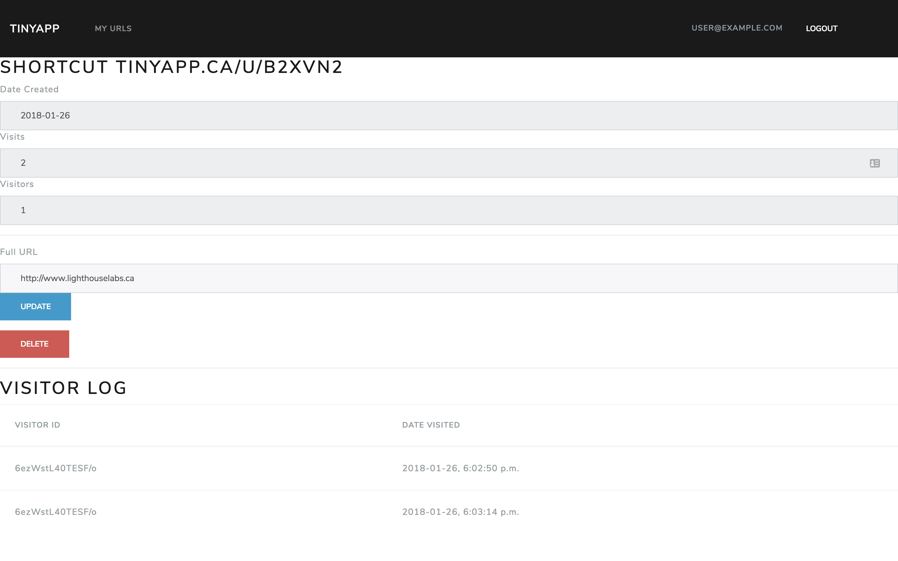

# TinyApp Project

TinyApp is a full stack web application built with Node and Express that allows users to shorten URLs (similar to goo.gl or tinyURL.com)


## Screenshots

Screenshot of Login Page](./docs/login.png)





## Dependencies

Core Language: `"Node.js": "^9.4.0"`

Node Depencies (available through `npm`):

```json
"bcrypt": "^1.0.3",
"body-parser": "^1.18.2",
"cookie-session": "^2.0.0-beta.3",
"ejs": "^2.5.7",
"express": "^4.16.2",
"validator": "^9.2.0"
```